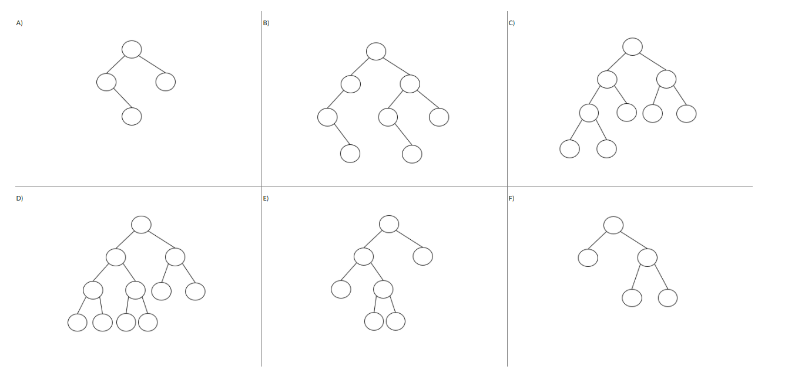
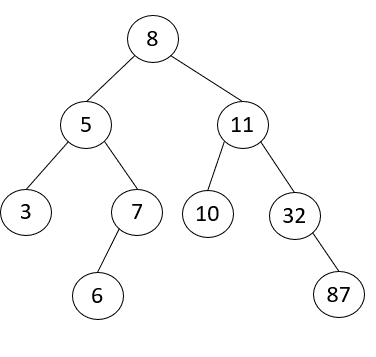
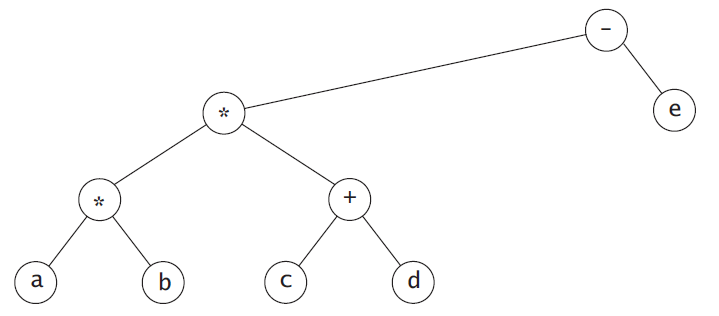

# Exam 2
## Multiple Choice Questions
### Question 1
#### Recall the implementation of a singly linked list discussed in Module 5. If you define the method mystery(self) inside the Linked List class as shown below, what does mystery do?
``` 
current = self.head
while current is not None:
    if current.value == 38:
        return True
    current = current.next
return False
```
Choices:

    a) Returns True if every node in the list has value 38, False otherwise 
    b) Returns True if no node in the list has value 38, False otherwise 
    c) Returns True if one node in the list has value 38, False otherwise <- 
    d) Returns True if the list has 38 nodes, False otherwise 

### Question 2
#### Recall the conversion from infix to postfix notation algorithm discussed in lectures. Assume that the algorithm has read and processed 10 tokens during the conversion and that the stack now look like this:
```
top |   |
    | - |
    | ( |
    | / |
    -----
```
What would be the status of the stack when the next element to be read and processed is an multiplication operation '*':

```
a) |   |
   |   |
   | * |
   | / |
   -----

b) |   |
   | * |
   | ( |
   | / |
   -----

c) | * | <-
   | - |
   | ( |
   | / |
   -----

d) |   |
   |   |
   |   |
   | * |
   -----
```

### Question 3
#### When implementing a queue with a linked list, where we keep track of the head node and tail node with two reference instance attributes (self.head and self.tail). Which of these reference attributes will change during an insertion (enqueue) into an empty queue?
    a)   Neither change 
    b)   Only head changes 
    c)   Both change <-
    d)   Only tail changes 


### Question 4
#### Given the following binary trees, select the trees that are complete trees. It is possible that more than one or none of the trees have this property.  


    (A)
    (B)
    (C) <-
    (D) <-
    (E)
    (F)
    None

### Question 5
#### The binary search tree shown below was created by inserting a sequence of items into an empty tree. Which of the given input sequences will NOT produce this binary search tree. 


    a) 8, 11, 5, 3, 10, 32, 6, 7, 87 <-
    b) 8, 11, 32, 87, 5, 7, 3, 6, 10 
    c) 8, 5, 11, 7, 10, 32, 87, 3, 6 
    d) 8, 5, 11, 3, 7, 10, 32, 6, 87 
    e) 8, 11, 5, 10, 7, 3, 32, 87, 6 

### Question 6
#### Based in the expression tree shown below, select the order that represent the nodes visited in a preorder traversal of the tree. 

