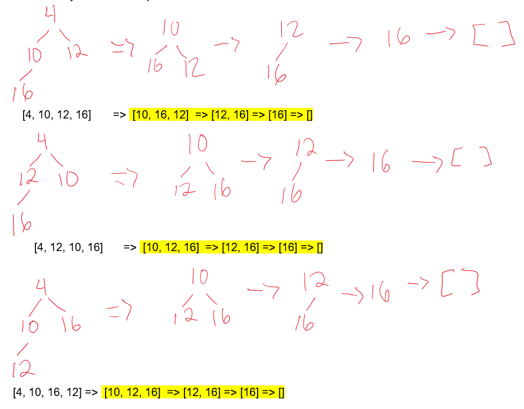

# Exam 2
## Multiple Choice Questions
### Question 1
Recall the implementation of a singly linked list discussed in Module 5. If you define the method mystery(self) inside the Linked List class as shown below, what does mystery do?
```py
current = self.head
while current is not None:
    if current.value == 38:
        return True
    current = current.next
return False
```
Choices:

    a) Returns True if every node in the list has value 38, False otherwise 
    b) Returns True if no node in the list has value 38, False otherwise 
    c) Returns True if one node in the list has value 38, False otherwise <- 
    d) Returns True if the list has 38 nodes, False otherwise 


### Question 2
Recall the conversion from infix to postfix notation algorithm discussed in lectures. Assume that the algorithm has read and processed 10 tokens during the conversion and that the stack now look like this:

```
top |   |
    | - |
    | ( |
    | / |
    ----
```
What would be the status of the stack when the next element to be read and processed is an multiplication operation '*':

```
a) |   |
   |   |
   | * |
   | / |
   -----

b) |   |
   | * |
   | ( |
   | / |
   -----

c) | * | <-
   | - |
   | ( |
   | / |
   -----

d) |   |
   |   |
   |   |
   | * |
   -----
```

### Question 3
When implementing a queue with a linked list, where we keep track of the head node and tail node with two reference instance attributes (self.head and self.tail). Which of these reference attributes will change during an insertion (enqueue) into an empty queue?

    a)   Neither change 
    b)   Only head changes 
    c)   Both change <-
    d)   Only tail changes 


### Question 4
Given the following binary trees, select the trees that are complete trees. It is possible that more than one or none of the trees have this property.  


    (A)
    (B)
    (C) <-
    (D) <-
    (E)
    (F)
    None

### Question 5
The binary search tree shown below was created by inserting a sequence of items into an empty tree. Which of the given input sequences will NOT produce this binary search tree. 


    a) 8, 11, 5, 3, 10, 32, 6, 7, 87 <-
    b) 8, 11, 32, 87, 5, 7, 3, 6, 10 
    c) 8, 5, 11, 7, 10, 32, 87, 3, 6 
    d) 8, 5, 11, 3, 7, 10, 32, 6, 87 
    e) 8, 11, 5, 10, 7, 3, 32, 87, 6 

### Question 6
Based in the expression tree shown below, select the order that represent the nodes visited in a preorder traversal of the tree. 


    a) a b * c d + * e - 
    b) - * * a b + c d e <-
    c) a * b * c + d - e 
    d) - * e * + a b 

### Question 7
Assume the following hash table was created using linear probing (+1 probe) as collision resolution technique:

|  0  |   1  |  2  |  3  |  4  |  5  |  6  |  7  |  8  |
|-|-|-|-|-|-|-|-|-|
| 27  | 0| | 21 | 48 | 50 | 49 | 30 | | 

If the hash function is key%size, in which order could the elements have been added to the hash table?

    a)   21, 27, 0, 48, 50, 30, 49 
    b)   27, 50, 49, 0, 21, 48, 30 
    c)   21, 50, 48, 27, 49, 0, 30 <-
    d)   21, 48, 50, 0, 49, 27, 30 

----
## Short Answer Questions

### Question 8
If you have a singly linked list with 3, 000,000 elements and you want to insert an element in the middle of the linked list, how many nodes of the list need to be moved from their current position in memory in order to insert the new node? Briefly justify your answer

    Sample Solution:
    0, we only update the next references, no nodes are moved from its current position in memory

    My Solution:
    The nodes of a linked list are stored in pseudorandom places in memory, and the pointers that connect the linked list point to memory addresses of the next node. Therefore, when inserting a node into a linked list, no node before or after it has to be moved. This is unlike an array which stores its values in one continuous bloc of memory.

### Question 9
One property of binary trees states that for every k≥1,there are no more than 2k-1 nodes in level k. What is the minimum and maximum number of non-leaf nodes in a complete binary tree of height 5? Provide your answer using exact numbers, no formulas or exponents

    Solution:
    Minimum = 2^4 = 16
    Maximum = 2^5 - 1 = 31

### Question 10
Assume you have a binary min-heap with exactly 4 nodes, containing the elements 4, 10, 12, and 16.

a)  Using the array representation of a binary heap, show every possible binary min-heap that could match the description given above.

b)  For one of your answers from (a), using the array representation of a binary heap, show what happens when 4 deleteMin operations are executed in the heap. Clearly indicate which heap you are using and show the heap after each deleteMin. You can just write the array representation after each call is completed, but if you prefer, you can write the array after each step.

    Solution: 
    a) [4, 10, 12, 16], [4, 12, 10, 16], [4, 10, 16, 12]

    b)  deleteMin([4, 10, 12, 16]) ->  [10, 16, 12]
        deleteMin([10, 16, 12]) -> [12, 16]
        deleteMin([12, 16]) -> [16]
        deleteMin([16]) -> []



### Question 11
Let H be a hash table where collisions are handled by separate chaining and where rehashing the entire table is used each time the load factor (number of items in the table divided by the size of the table) exceeds ½. If the initial size of H is 4 and rehashing doubles the size of the table, what is the size of the hash table H after inserting 10 items with different keys?

    Solution: 
    The size of the hash table after inserting 10 items will be 32.

### Question 12
a) Based on the undirected graph shown below, in a piece of paper, draw the BFS tree and DFS tree that will result when calling BFS and DFS starting at node A.  In the textbox below, list the order in which the nodes are visited in a BFS traversal of the BFS tree and a preorder traversal of the DFS tree.

b) Complete the sequence of edges in the MST in the order that Prim's algorithm includes them when building the tree starting at node B. For example BC, BF, etc.

c) What if the cost of the Minimum Spanning Tree for such graph?


```
Solution:
a) BFS Tree:                       DFS Tree:

       A                               A
      / \                              |
     B   D                             B
   / | \                             /  \
  C  E  F                           C    D
                                   / \
                                  E   F
b) BC, BA, AD, BF, BE
c) 66 
```
----
## Coding Questions
### Question 13
Write the Python function toList(linked_list) that takes a Singly Linked List (implemented using the class definition from the lectures, with a head and tails pointers) and returns a Python list that contains all values of linked_list in the same order. It does not modify linked_list. The only assumption that you can make is that none of the elements in the linked list is another linked list.

Example:

For the linked list x =  3 -> 5 -> 8 -> 9, toList(x)  returns the Python List [3, 5, 8, 9]

``` py
Solution: 
def toList(linked_list):
   retList = []
   temp = linked_list
   while temp:
      retList.append(temp.value)
      temp = temp.next
   return retList
```

### Question 14
Recall the Stack class from Homework 3. Such data structure contained a reference to the top node in the stack and can perform the operations len, isEmpty, push, pop and peek only. Write the Python code for the method deleteLargest( ) that takes no parameters and will find and remove the largest value in the Stack. When the Stack is empty, it returns None, otherwise, it returns the maximum value and updates the original stack. You can assume all values in the stack are numeric.

For example, if the stack x contains the elements 5, 7, 9, 3, 1, 6, then a call to deleteLargest returns 9, and  x is now 5, 7, 3, 1, 6:
```py
>>> x
Top:Node(5)
Stack:
5
7
9
3
1
6
>>> x.deleteLargest()
9
>>> x
Top:Node(5)
Stack:
5
7
3
1
6
```
```py
My Solution:
def deleteLartest(self):
    if self.isEmpty():
        return None

    largest = self.peek()
    tempStack = Stack()

    while not self.isEmpty():
        currVal = self.pop()
        if currVal > largest:
            largest = currVal
        tempStack.push(currVal)

    while not tempStack.isEmpty():
        popVal = tempStack.pop()
        if popVal != largest:
            self.push(popVal)
    return largest
```


